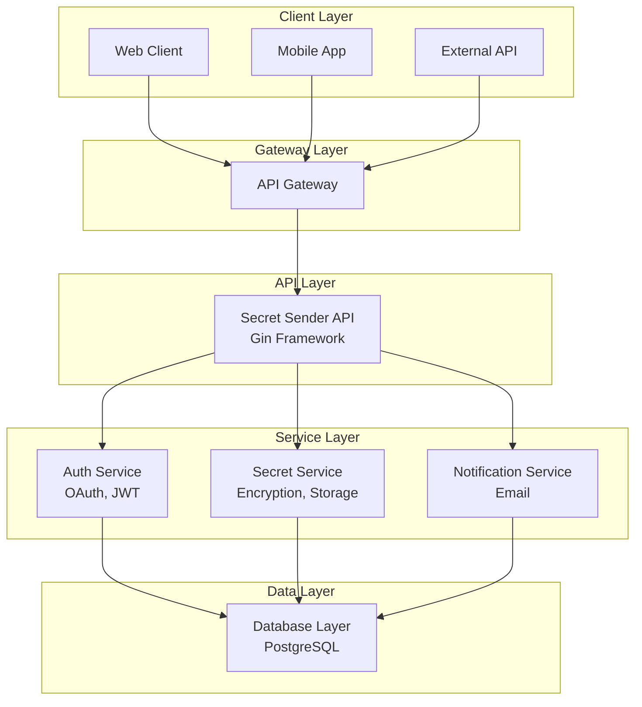

# Secret Sender

[](https://golang.org/)
[](https://gin-gonic.com/)
[](LICENSE)
[](#security)

Una API REST segura para el envío y gestión de datos sensibles (credenciales, tokens, certificados) con enfoque en seguridad, auditoría y compliance GDPR.

## 🚀 Características Principales

### Seguridad
- **Encriptación End-to-End**: AES-256-GCM para datos en tránsito y reposo
- **Autenticación OAuth 2.0**: Integración con Google OAuth
- **JWT con Refresh Tokens**: Gestión segura de sesiones
- **Rate Limiting**: Protección contra ataques de fuerza bruta
- **Validación de Entrada**: Sanitización y validación robusta de datos
- **Logging de Auditoría**: Registro completo de todas las operaciones

### Gestión de Secretos
- **Compartir Secretos**: Envío seguro entre usuarios autenticados
- **Notificaciones por Email**: Alertas automáticas de entrega
- **Expiración Automática**: Gestión del ciclo de vida de secretos
- **Trazabilidad Completa**: Registro de quién envía y recibe cada secreto

### Compliance y Auditoría
- **GDPR Compliant**: Cumplimiento con regulaciones de protección de datos
- **Auditoría Completa**: Logs estructurados para auditoría
- **Health Checks**: Monitoreo de estado del sistema
- **Métricas de Seguridad**: Tracking de intentos de acceso y operaciones

## 🏗️ Arquitectura


## 🛠️ Stack Tecnológico

### Backend
- **Go 1.25**: Lenguaje de programación
- **Gin**: Framework web HTTP
- **PostgreSQL**: Base de datos principal
- **Redis**: Cache y sesiones
- **JWT-Go**: Manejo de tokens JWT
- **Crypto/AES**: Encriptación de datos

### Infraestructura
- **Docker**: Containerización
- **Docker Compose**: Desarrollo local
- **Kubernetes**: Orquestación en producción
- **Prometheus**: Métricas y monitoreo
- **Grafana**: Dashboards de monitoreo

### Seguridad
- **OAuth 2.0**: Autenticación con Google
- **bcrypt**: Hash de contraseñas
- **TLS 1.3**: Comunicación segura
- **Helmet**: Headers de seguridad HTTP

## 📋 Prerrequisitos

- Go 1.25 o superior
- Docker y Docker Compose
- PostgreSQL 13+
- Redis 6+
- Cuenta de Google para OAuth (opcional para desarrollo)

## 🚀 Instalación y Configuración

### Desarrollo Local

1. **Clonar el repositorio**
```bash
git clone https://github.com/tu-usuario/go-secret-sender.git
cd go-secret-sender
```

2. **Configurar variables de entorno**
```bash
cp .env.example .env
# Editar .env con tus configuraciones
```

3. **Ejecutar con Docker Compose**
```bash
docker-compose up -d
```

4. **Verificar instalación**
```bash
curl http://localhost:8080/health
```

### Producción con Kubernetes

```bash
# Aplicar configuraciones
kubectl apply -f k8s/

# Verificar despliegue
kubectl get pods -n secret-sender
```

## 📚 API Documentation

### Autenticación

#### POST /auth/google
Inicia el flujo de autenticación con Google OAuth.

**Response:**
```json
{
  "auth_url": "https://accounts.google.com/oauth/authorize?...",
  "state": "random-state-token"
}
```

#### POST /auth/callback
Callback para completar la autenticación OAuth.

**Request:**
```json
{
  "code": "authorization-code",
  "state": "random-state-token"
}
```

**Response:**
```json
{
  "access_token": "jwt-access-token",
  "refresh_token": "jwt-refresh-token",
  "expires_in": 3600
}
```

### Gestión de Secretos

#### POST /secrets
Crear un nuevo secreto.

**Request:**
```json
{
  "title": "Database Credentials",
  "content": "encrypted-secret-data",
  "recipient_email": "user@example.com",
  "expires_at": "2024-12-31T23:59:59Z",
  "type": "password"
}
```

**Response:**
```json
{
  "id": "secret-uuid",
  "title": "Database Credentials",
  "created_at": "2024-01-01T00:00:00Z",
  "expires_at": "2024-12-31T23:59:59Z",
  "status": "pending"
}
```

#### GET /secrets
Listar secretos del usuario autenticado.

**Query Parameters:**
- `page`: Número de página (default: 1)
- `limit`: Elementos por página (default: 20)
- `status`: Filtrar por estado (pending, delivered, expired)

#### GET /secrets/{id}
Obtener detalles de un secreto específico.

#### DELETE /secrets/{id}
Eliminar un secreto (soft delete).

### Notificaciones

#### GET /notifications
Listar notificaciones del usuario.

#### POST /notifications/{id}/read
Marcar notificación como leída.

### Monitoreo

#### GET /health
Health check del sistema.

**Response:**
```json
{
  "status": "healthy",
  "timestamp": "2024-01-01T00:00:00Z",
  "version": "1.0.0",
  "services": {
    "database": "healthy",
    "redis": "healthy",
    "email": "healthy"
  }
}
```

#### GET /metrics
Métricas del sistema (formato Prometheus).

## 🔒 Seguridad

### Encriptación
- **Datos en Tránsito**: TLS 1.3 para todas las comunicaciones
- **Datos en Reposo**: AES-256-GCM con claves derivadas de contraseña
- **Claves**: Rotación automática cada 90 días

### Autenticación y Autorización
- **OAuth 2.0**: Integración con Google
- **JWT**: Tokens de acceso con expiración de 1 hora
- **Refresh Tokens**: Renovación automática de sesiones
- **Rate Limiting**: 100 requests/minuto por usuario

### Auditoría
- **Logging Estructurado**: JSON logs con contexto completo
- **Trazabilidad**: ID único para cada operación
- **Retención**: Logs conservados por 7 años (GDPR compliant)

### Compliance GDPR
- **Derecho al Olvido**: Eliminación completa de datos personales
- **Portabilidad**: Exportación de datos en formato estándar
- **Consentimiento**: Registro explícito de consentimiento
- **Notificación de Brechas**: Alertas automáticas en caso de incidentes

## 🧪 Testing

### Ejecutar Tests
```bash
# Tests unitarios
go test ./...

# Tests de integración
go test -tags=integration ./...

# Tests de seguridad
go test -tags=security ./...

# Coverage
go test -coverprofile=coverage.out ./...
go tool cover -html=coverage.out
```

### Tests de Seguridad
- **Penetration Testing**: Tests automatizados de vulnerabilidades
- **Fuzzing**: Tests de entrada maliciosa
- **Dependency Scanning**: Verificación de vulnerabilidades en dependencias

## 📊 Monitoreo y Observabilidad

### Métricas
- **Latencia**: Tiempo de respuesta por endpoint
- **Throughput**: Requests por segundo
- **Errores**: Tasa de errores por tipo
- **Seguridad**: Intentos de acceso fallidos, rate limiting

### Alertas
- **Disponibilidad**: Sistema no disponible
- **Latencia**: Tiempo de respuesta > 2s
- **Errores**: Tasa de errores > 5%
- **Seguridad**: Múltiples intentos de acceso fallidos

## 🤝 Contribución

1. Fork el proyecto
2. Crea una rama para tu feature (`git checkout -b feature/AmazingFeature`)
3. Commit tus cambios (`git commit -m 'Add some AmazingFeature'`)
4. Push a la rama (`git push origin feature/AmazingFeature`)
5. Abre un Pull Request

### Estándares de Código
- **Go fmt**: Formateo automático
- **Go vet**: Análisis estático
- **Golangci-lint**: Linting avanzado
- **Tests**: Cobertura mínima del 80%

## 📄 Licencia

Este proyecto está bajo la Licencia MIT. Ver el archivo [LICENSE](LICENSE) para más detalles.

## 🆘 Soporte

- **Documentación**: [Wiki del proyecto](https://github.com/tu-usuario/go-secret-sender/wiki)
- **Issues**: [GitHub Issues](https://github.com/tu-usuario/go-secret-sender/issues)
- **Discusiones**: [GitHub Discussions](https://github.com/tu-usuario/go-secret-sender/discussions)
- **Email**: lucaspintos909@gmail.com

## 🔄 Roadmap

### v1.0.0 (Actual)
- [ ] API REST básica
- [ ] Autenticación OAuth con Google
- [ ] Encriptación de secretos
- [ ] Notificaciones por email

### v1.1.0 (Próximo)
- [ ] Interfaz web
- [ ] API de webhooks
- [ ] Integración con más proveedores OAuth
- [ ] Dashboard de administración

### v2.0.0 (Futuro)
- [ ] Aplicación móvil
- [ ] Integración con sistemas de gestión de secretos empresariales
- [ ] Soporte para secretos de equipo
- [ ] API GraphQL

---

**⚠️ Advertencia de Seguridad**: Este software maneja datos sensibles. Asegúrate de seguir las mejores prácticas de seguridad y mantener el software actualizado.
